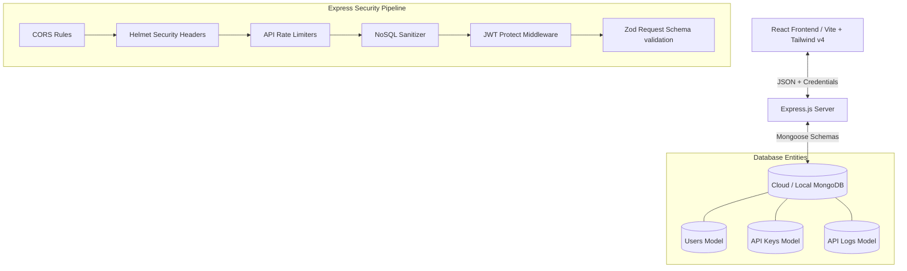

# ApexKey - API Key Management & Analytics SaaS

ApexKey is a production-grade, secure, and performant API Key Credentials Vault and real-time Analytics SaaS dashboard built on the MERN stack. Designed with a premium dark-themed, glassmorphic UI matching the look and feel of modern services like Stripe, Linear, and Supabase, ApexKey represents a fully functional startup MVP.

---

## 🏗️ Architecture Diagram



---

## 📂 Folder Structure

```
PrimeTrade_Assignement/
├── backend/
│   ├── src/
│   │   ├── config/          # Mongoose database & server configurations
│   │   ├── controllers/     # Controller logic (Auth, API Keys, Analytics, Users)
│   │   ├── middleware/      # Guards: auth, roles, error-handlers, rate limiters, validators
│   │   ├── models/          # User, ApiKey, ApiLog schemas
│   │   ├── routes/          # Express API route endpoints
│   │   ├── utils/           # Encryption utilities, asyncHandler wrappers, standard responses
│   │   ├── validators/      # Zod validation schemas for request bodies
│   │   └── docs/            # Swagger API documentation annotations
│   ├── server.js            # Main Node/Express boot entrypoint
│   └── app.js               # Express application configuration pipeline
└── frontend/
    ├── src/
    │   ├── components/      # Reusable UI (ProtectedRoutes, loading skeletons, modal overlays)
    │   ├── context/         # AuthContext & ThemeContext React states
    │   ├── layouts/         # Collapsible sidebar dashboard templates
    │   ├── pages/           # LandingPage, AuthPages, Dashboard, ApiKeyManagement, Logs, Settings, AdminConsole
    │   ├── services/        # Axios API client instances with 401 interceptor refreshing
    │   ├── index.css        # Main tailwind imports & CSS theme configuration
    │   └── App.jsx          # Route dispatcher & React context providers
```

---

## 🔒 Security Implementations

ApexKey adheres to strict web security standards and OWASP Top 10 compliance:
1. **Password Hashing**: Cryptographic password encryption using `bcryptjs` before storage.
2. **Cryptographic Key Hashing**: Plain text API keys are shown to developers **exactly once** upon creation. The database stores only a secure SHA-256 hash `keyHash` and the last 4 digits `keyLast4` for tracking. Clicks are authenticated by hashing incoming keys and looking up their corresponding records.
3. **Session Refresh Token Rotation**: Dual token authentication. Access tokens are kept in memory and refresh tokens are stored in secure, HTTP-only, SameSite cookies.
4. **Input Validation**: Request bodies, query parameters, and endpoints are validated against Zod schemas.
5. **Helmet Integration**: Automatic HTTP header settings to prevent MIME sniffing, clickjacking, and XSS.
6. **NoSQL Sanitization**: `express-mongo-sanitize` scrubs user inputs to prevent MongoDB injection queries.
7. **Rate Limiting**: Custom limits prevent brute force attacks on authentication routes (`20 req/15m`) and overall API endpoints (`300 req/15m`).

---

## 🚀 Scalability Notes

To evolve this monolith architecture into a high-throughput, enterprise platform, the following scaling components can be added:

1. **Redis Caching Layer**:
   - Cache API key lookup: API keys are validated on every request. Caching hashed key queries (e.g. `keyHash -> keyMetadata`) in Redis with an eviction policy avoids round-trips to MongoDB.
   - Cache telemetry data: Buffer API logs in a Redis queue and bulk insert them into MongoDB using cron scripts.

2. **Dockerization**:
   - Containerize backend, frontend, and database services to ensure exact parity across development and deployment environments.
   
3. **Load Balancing & Horizontal Scaling**:
   - Run multiple Node.js server processes utilizing PM2 Cluster Mode or Kubernetes replicas.
   - Route traffic through an Nginx or AWS ALB load balancer using round-robin distribution.

4. **Microservices Migration**:
   - Decouple the Core App (Auth, Key Issuance, Admin management) from the high-performance API Gateway (the proxy that intercepts client requests, validates key tokens against Redis, and forwards to services).

---

## 🛠️ Installation Guide

### Prerequisites
- Node.js (v18+)
- Local MongoDB instance or MongoDB Atlas URI

### 1. Backend Setup
1. Open the backend directory:
   ```bash
   cd backend
   ```
2. Install dependencies:
   ```bash
   npm install
   ```
3. Set up environment variables inside a `.env` file:
   ```env
   PORT=5001
   MONGO_URI=mongodb://127.0.0.1:27017/apexkey
   JWT_ACCESS_SECRET=your_jwt_access_secret_key
   JWT_REFRESH_SECRET=your_jwt_refresh_secret_key
   JWT_ACCESS_EXPIRY=15m
   JWT_REFRESH_EXPIRY=7d
   NODE_ENV=development
   ```
4. Start the Node.js server in development mode:
   ```bash
   npm run dev
   ```

### 2. Frontend Setup
1. Open the frontend directory:
   ```bash
   cd ../frontend
   ```
2. Install packages:
   ```bash
   npm install
   ```
3. Boot up the Vite local hot-reloaded development environment:
   ```bash
   npm run dev
   ```
4. Open the browser to: `http://localhost:5173`

### 3. Database Seeding (Analytics & Keys Preview)
To instantly visualize beautiful dashboard charts, seed logs into your account:
1. Register a new user account via the frontend (`http://localhost:5173/register`).
2. Run the seeding tool from the backend folder:
   ```bash
   cd ../backend
   npm run seed
   ```
3. Go back to your frontend dashboard and refresh. You will see 7 days of request logs, latencies, and active keys fully populated!

---

## 📑 API Documentation (Swagger & Versioning)

API endpoints are fully versioned under `/api/v1/`. Swagger docs are built using JSDoc.

### Boot the backend server and visit:
`http://localhost:5001/api-docs`

### Major Endpoint Schemas:

#### Authentication Routes (`/api/v1/auth/`)
- `POST /register`: Registers a developer profile. Returns Access Token and sets Cookie.
- `POST /login`: Log in existing users.
- `POST /refresh-token`: Handshake endpoint. Automatically called by Axios to rotate tokens.
- `POST /logout`: Clears session tokens.
- `GET /profile`: Fetch active logged-in profile data.

#### Key CRUD Routes (`/api/v1/keys/`) - Requires JWT Bearer Token
- `POST /`: Creates a key. Returns the raw key once.
- `GET /`: Get paginated, sorted, and filtered keys (Search by name).
- `PUT /:id`: Modify metadata (permissions, rate limit, status).
- `POST /:id/regenerate`: Regenerates key string while preserving metadata and usage stats.
- `DELETE /:id`: Permanently deletes API keys.

#### Analytics Routes (`/api/v1/analytics/`) - Requires JWT Bearer Token
- `GET /overview`: Returns dashboard widget stats, Recharts lines, and recent activity logs.
- `GET /logs`: Paginated log audit trails.
